# Upwork Expert Test Platform

A Next.js + TypeScript demo platform for testing full stack, AI engineering, and n8n
automation candidates. It mimics familiar marketplace hiring patterns while staying
clearly positioned as a **local assessment demo**.

Created by **Zubair-Hussain**.

<p align="center">
  
</p>

> ☝️ The banner above is a live, looping preview of the in-app **Freelancer Plus
> carousel** (an animated SVG). It cycles through all three perks with sliding text and
> filling progress bars — the same motion the running app shows at `/`. If your viewer
> renders SVG animation you'll see it move; on GitHub it plays automatically.

<p align="center">
  
</p>

<p align="center">
  
  
  
  
  
</p>

> New here / vibe coding? Read [`docs/README.md`](docs/README.md) first. The `docs/`
> folder explains every file, every screen, and every click in plain language so you
> can understand the whole app without reading the code.

---

## ✨ Animations (just like Upwork)

The app now moves the way the real Upwork dashboard does. Nothing is decorative for
its own sake — each motion points your eye at the thing that matters.

### The Freelancer Plus carousel (the headline feature)

At the very top of the home page (`/`) sits a **rotating "Freelancer Plus with new
perks" banner** — a pixel-for-feel copy of the banner Upwork shows freelancers. It is
built in [`components/PlusBanner.tsx`](components/PlusBanner.tsx).

It rotates through **all three perks**, one every 6 seconds:

| # | Perk (the animated headline text) |
|---|-----------------------------------|
| 1 | **100 monthly Connects and full access to Uma, Upwork's Mindful AI.** |
| 2 | **See competitor bids so you can price every proposal with confidence.** |
| 3 | **Keep your profile visible and claim a custom URL, even on a break.** |

Every slide uses the **same animation set**:

- **Text slide-in** — the eyebrow, the headline, and the "Learn more" button each
  fade up from below in a short stagger every time the slide changes. (This is the
  "animation of text" you asked for.)
- **Progress bars** — three bars at the bottom act as the pagination dots. The active
  one **fills left-to-right** over the 6 seconds, then hands off to the next.
- **Floating illustration** — the art on the right gently floats up and down forever
  and pops in on each slide swap.
- **Pause / play control** — the small ⏸ button freezes the rotation (and the fill).

### Motion everywhere else

| Where | Animation | Why |
|-------|-----------|-----|
| Job cards (`/`) | Staggered **rise-in** on load; **lift + shadow** on hover | Feels like a live feed |
| Connects meter | Width transition when connects are spent + a **shimmer sweep** | Makes spend feel real |
| **Bid / record rows** (admin) | Staggered **slide-in from the left**; nudge-right on hover | The "animation of bid" |
| **Boost bid leaderboard** (job page) | Rows fade in one after another like a live ranking | Shows bidding pressure |
| Fit score (admin) | **Pop-in** so the number lands first | Draws the reviewer's eye |
| Buttons | Lift + soft shadow on hover | Standard marketplace feel |
| Success toast | Slides up from the corner | Confirms an action |

All motion respects the OS **"reduce motion"** setting — if the user asks for less
motion, every animation collapses to an instant, still state (see the bottom of
[`app/globals.css`](app/globals.css)).

---

## 🧭 Every screen and every selection

This section describes **every single button, field, and choice** in the app, screen
by screen. For the deeper "why", each screen links to its doc.

### 1. Candidate home — `/` → [doc](docs/01-candidate-home.md)

The candidate's landing screen. Rendered by
[`components/PlatformClient.tsx`](components/PlatformClient.tsx).

- **Freelancer Plus banner** — the rotating carousel described above.
  - **"Learn more"** button — demo only, no navigation.
  - **⏸ / ▶ button** — pause or resume the rotation.
  - **Three progress bars** — click any one to jump straight to that perk.
- **Welcome panel** — shows the required label **"Welcome to Upwork expert test"** and
  four guideline cards: *Read every post*, *Start with your name*, *Show expert
  judgment*, *Spend connects wisely*.
- **Candidate Test Profile** (right sidebar):
  - **"What is your name?"** input — the candidate's name.
  - **"Short description"** input — a one-line headline.
  - **"Save profile"** button — validates that both fields are filled, then stores the
    profile so the admin can see it. Shows a toast on success or on a missing field.
  - **Connects meter** — animated bar showing `remaining / 75` connects and `x/7 applied`.
  - **Mini stats** — live **Fit score**, **Client views**, and **Records** counts.
  - **Fit label** — a plain-English verdict (e.g. *Promising fit*).
- **Job filter tabs** — **All**, **Full Stack**, **AI Engineering**, **n8n Automation**.
  Clicking one filters the job grid instantly.
- **Job cards** (seven of them). Each card shows the title, posted-time, budget, level,
  a **connects pill** (turns orange for the 30-connect job), the summary, bid counts,
  a *Client viewed* flag if applicable, and skill chips. Two actions:
  - **"Open"** — go to the job detail page.
  - **"Apply" / "Applied"** — go to the job detail page; the label flips to *Applied*
    (with a check icon) once an application exists for that job.
- **"Client View"** button (top right) — jumps to the client route.

### 2. Job detail & application — `/jobs/[id]` → [doc](docs/02-job-detail.md)

The dark Upwork-style workspace. Rendered by
[`components/JobDetailClient.tsx`](components/JobDetailClient.tsx). This is where the
candidate actually applies. Every selection:

- **Left rail** — decorative workspace nav (Search, Home, Messages, Contracts, etc.).
- **Job list preview** — three preview cards mimicking Upwork's "Best matches" list.
- **"Open job in a new window"** link — demo only.
- **Client card** (right):
  - **"Apply now"** — scrolls to the proposal form.
  - **"Save job"** button and **"Flag as inappropriate"** — demo only.
  - Client facts: rating, **payment verified / not verified**, **phone verified / not
    verified** (some clients intentionally show a missing verification so the admin can
    judge risk), location, jobs posted, hire rate, total spent.
- **Proposal form** — the core of the test:
  - **"What is your name?"** input — required.
  - **"How do you want to be paid?"** radio choice:
    - **By milestone** — split the project into approved milestones.
    - **By project** — one payment at the end.
  - **"What is the full amount you would like to bid?"** number input — required, must
    be > 0. Feeds a live **10% service fee** line and a **"You will receive"** line.
  - **"Cover letter"** textarea — required proposal text.
  - **"Attach files"** button — demo only.
  - **"Your expert answer"** textarea — required; this is where the candidate answers
    the screening questions. Answers **≥ 90 characters** earn extra fit points.
  - **"Your boosted Connects bid"** number input — required for the test; enter **0**
    for no boost. Adds to the connects spent. A **live leaderboard table** shows where
    that bid would rank.
  - **Connects meter** — shows connects left vs. total needed for this proposal.
  - **"Apply now" / "Update application"** button — validates every required field,
    checks the candidate has enough connects, then saves. If connects run out or the
    remaining balance drops below 40, it shows the "thanks for completing the test"
    message.

> **Client mode:** the same page at `/client/jobs/[id]` renders in a read-only "client"
> mode that hides the form and instead **records that the client viewed the job**.

### 3. Client job list — `/client/jobs` → [doc](docs/03-client-view.md)

Rendered by [`components/ClientJobs.tsx`](components/ClientJobs.tsx). Lists all seven
jobs with a single **"View as client"** button each. Opening one marks the job as
*viewed* — a signal the admin dashboard reads.

### 4. Admin login — `/admIn` → [doc](docs/04-admin.md)

Rendered by [`components/AdminLoginClient.tsx`](components/AdminLoginClient.tsx).

- **"Email"** input — pre-filled with the seeded admin email.
- **"Password"** input — the admin password.
- **"Enter admin"** button — posts to `/api/admin/login`, which sets a JWT cookie on
  success and reloads into the review board.

### 5. Admin review board — `/admIn` (after login) → [doc](docs/04-admin.md)

Rendered by [`components/AdminClient.tsx`](components/AdminClient.tsx).

- **Fit decision panel** — candidate name, description, the big animated **Fit score
  /100**, the fit label, and mini stats (Applied jobs, Connects left, Record picks).
- **"How Admin Should Read This"** — guidance on interpreting the data.
- **Job Review Board** — one row per job showing the application (bid, boost, milestone,
  cover letter, answer), a **Client viewed / Not viewed** pill, and the post guide.
  - **"Select record" / "Remove record"** button — toggles whether an application is
    saved for final review (worth fit points).
- **"Reset"** button (top) — clears all demo data from local storage.
- **"Candidate Portal"** button — back to `/`.

### 6. Not found — any unmatched URL → 404

Rendered by [`app/not-found.tsx`](app/not-found.tsx). Next.js shows this automatically
for any route that doesn't exist. It keeps the green branding and is fully animated.

<p align="center">
  
</p>

- **Spinning compass badge** — rotates forever, "looking" for the missing page.
- **Floating "404"** — bobs up and down.
- **"Back to jobs"** button — returns to `/` (also pulses gently).
- **"Browse as client"** button — jumps to `/client/jobs`.

---

## Routes

- `/` Candidate portal, Freelancer Plus banner, and job feed.
- `/jobs/[id]` Candidate job detail and application screen.
- `/client/jobs` Client-facing job list.
- `/client/jobs/[id]` Client job detail; opening it marks the job as viewed.
- `/admIn` Hidden admin board with JWT-protected login, fit score, client-view signal,
  and record selection.
- `*` Any unmatched URL renders the custom animated 404 page (`app/not-found.tsx`).

## Getting Started

```bash
npm install
npm run dev
```

Open `http://localhost:3000`.

## Test And Coverage

```bash
npm test
npm run coverage
```

Coverage is generated by Vitest with the V8 provider; the HTML report lands in
`coverage/`.

## How scoring works (quick reference)

Full detail lives in [`docs/05-scoring-and-data.md`](docs/05-scoring-and-data.md).

- **Starting connects:** 75. The seven jobs cost exactly 75 in total.
- **Connects spent** = each job's required connects **+** the boost you enter.
- **Fit score** = applications ×9 + deep answers (≥90 chars) ×5 + record picks ×3 +
  client views ×2 + a 14-point bonus for applying to all seven, capped at 100.

## Notes

Admin access is hidden from the public UI and protected by a demo JWT cookie. The
seeded LiteSQL-style admin record is `thezubairh@gmail.com`. For production, replace the
demo seed with a real SQLite/LiteSQL table, hashed passwords, audit logs, CSRF
protection, rate limits, and database-backed application records.

## Visual Assets

Marketplace-style green branding, human proposal icons from `lucide-react`, and local
SVG assets in `public/assets/` so screenshots render without external downloads:

- `public/assets/upwork-logo.svg`
- `public/assets/payment-verified.svg`
- `public/assets/money-protection.svg`
- `public/assets/profile-portfolio.svg`
- `public/assets/profile-certificate.svg`
# Upwork_demo-

